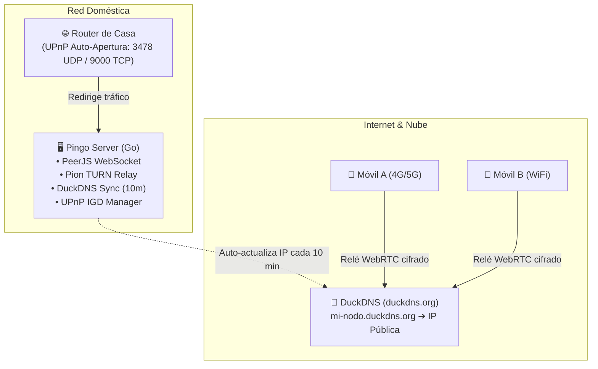

# Pingo - P2P Communication Guide (WebRTC & PeerJS)

This document explains how PeerJS and WebRTC work together to enable real-time location sharing in Pingo.

## 1. The Architecture
Pingo uses a "Hybrid P2P" approach for maximum privacy and low latency.

*   **Signaling (Centralita)**: A central server (`peerjs-server.accreativos.com`) used only for "introductions". It never touches your location data.
*   **Data Channel (Túnel)**: Una conexión directa entre navegadores donde viajan las coordenadas, mensajes de chat y **datos de rutas compartidas** (protocolo Git).

---

## 2. The Connection Lifecycle

### Phase A: Registration (Signaling)
1.  **Handshake**: Your app connects to the signaling server.
2.  **ID Assignment**: You get a unique Peer ID (derived from your secret phrase).
3.  **Status**: In the UI, the **main logo logo** turns green. This means you are "online" and reachable.

### Phase B: Discovery (STUN)
1.  **Finding IPs**: Since most devices are behind routers/NAT, they don't know their public IP.
2.  **STUN Servers**: We use public STUN servers (Google, Cloudflare) to ask: "What is my public IP and port?".
3.  **Exchange**: The signaling server tells Peer A the public IP of Peer B and vice-versa.

### Phase C: P2P Data Connection (WebRTC)
1.  **Direct Tunnel**: Both peers attempt to connect directly to each other's public IPs.
2.  **Successful**: If the NAT allows it, the connection opens. In the UI, the **agenda contact** turns green.
3.  **Failed**: If a firewall or a **Symmetric NAT (5G/4G)** blocks the direct path, the connection fails.

---

## 3. Resilience and Fallbacks

### Why does it fail sometimes? (NAT Traversal)
*   **Home WiFi**: Usually allows "hole punching" (STUN works well).
*   **Mobile Networks (4G/5G)**: Often use CGNAT or Symmetric NAT, which are much more restrictive.

### Solución: Relé (TURN) ✅
Pingo ahora soporta un **Servidor TURN** propio como relé. Se activa opcionalmente desde Ajustes > Servicios en la Nube.
- **Cómo funciona**: Si el túnel directo P2P falla, el tráfico se encamina a través de un servidor intermedio (Coturn).
- **Privacidad**: El servidor relé solo retransmite los paquetes WebRTC cifrados; NO puede ver tu ubicación.
- **Infraestructura**: Desplegado vía Docker con credenciales temporales generadas dinámicamente por un Cloudflare Worker.

---

## 4. Media Streaming (Video & Screen Share)
Pingo supports P2P video and screen sharing through WebRTC MediaStreams (`navigator.mediaDevices`).
*   **Mesh Relay**: When a user shares their camera or screen, the `MediaManager` captures the stream and broadcasts it. If Peer A is connected to Peer B and Peer C, and shares their screen, both B and C receive it. If B is also connected to D (but A is not), B can act as a relay and forward the stream to D, establishing a multi-node broadcast mesh.
*   **Dynamic UI**: Video feeds are rendered dynamically in the UI and can be enlarged or collapsed, with labels indicating the origin of the stream and the relay path (e.g., `Pingo: A (vía B)`).

---

## 5. Distributed Search Engine
Pingo integrates a full-text search engine (`MiniSearch`) designed for local-first, peer-to-peer discovery.
*   **Local Indexing**: Routes, notes, and links are indexed locally on the device using the `SearchManager`.
*   **Privacy Controls**: Each indexed item has a visibility toggle (`public` or `private`).
*   **Network Discovery**: When you perform a search, Pingo can query your connected peers for relevant public items, effectively acting as a distributed knowledge base without relying on central databases.

---

## 6. Connection Success Rates (Estimates)

The success of a direct P2P connection (STUN-only) depends heavily on the network topology:

| Scenario | Success Rate | Reason |
| :--- | :--- | :--- |
| **WiFi to WiFi** | **~99%** | Most home routers allow "hole punching". |
| **WiFi to 4G/5G** | **~70%** | Carrier NAT can sometimes block incoming P2P. |
| **5G to 5G** | **~30%** | Very high restriction due to Symmetric NAT. |

---

## 7. Spanish Operators NAT Behavior

Connectivity success in Spain (estimates based on CGNAT usage):

| Operator | NAT Type | P2P Status | Notes |
| :--- | :--- | :--- | :--- |
| **Movistar / O2** | No CGNAT | **Excellent** | Assigns public IPv4. Best for P2P. |
| **Vodafone** | No CGNAT | **Excellent** | Generally assigns public IPv4. |
| **Orange / Jazztel** | DS-Lite (PCP) | **Good** | CGNAT mitigated by PCP protocol. |
| **Digi** | Strict CGNAT | **Poor** | Works great if adding "Conexión Plus" (+1€). |
| **Yoigo / Pepephone** | Strict CGNAT | **Poor** | Usually restricted unless opted-out (Fiber only). |

---

## 8. Troubleshooting
*   **Green header, Red contact**: You are online, but the network between you and your contact is blocking the P2P connection. Try switching from 5G to WiFi or vice-versa.
*   **Timeout Error**: Common in mobile browsers when the app is backgrounded or GPS signal is weak.

---

## 9. Autoalojamiento Doméstico: Opciones para Servidores PeerJS y TURN en Casa

Para que usuarios particulares ("personas normales") puedan montar en sus hogares sus propios servidores de señalización (PeerJS) y relé (TURN/STUN) sin depender de infraestructura centralizada de terceros, existen 4 arquitecturas viables adaptadas a diferentes niveles técnicos:

### Los dos grandes retos en conexiones domésticas
1. **CGNAT / IP Dinámica y Apertura de Puertos**: Muchos operadores asignan CGNAT (o IPs dinámicas) y los usuarios no saben o no pueden abrir puertos (Port Forwarding) en el router.
2. **Certificados SSL/TLS (HTTPS / WSS)**: WebRTC y las PWAs exigen conexiones seguras con dominios y certificados válidos.

---

### Las 4 Estrategias de Despliegue Doméstico

#### 🥇 Opción 1: Binario "Todo en Uno" en Go (PeerJS + Pion TURN/STUN) ✅ [IMPLEMENTADO]
* **Ubicación en el repositorio**: [`server/`](file:///home/jose/workspace/pingo/server)
* **Concepto**: Un ejecutable compilado en Go (para Linux `amd64`/`arm64`, Windows `.exe` o macOS) que encapsula todo lo necesario:
  * **PeerJS Server** en Go integrado (señalización WebSocket en `/peerjs`, `/id`).
  * **TURN/STUN Server** integrado mediante la librería Go **`pion/turn`** en UDP (3478).
  * **Dashboard Web y QR de vinculación**: Al arrancar muestra en terminal y en web un QR interactivo y enlace para autoconfigurar Pingo.
  * **Compilación**:
    ```bash
    cd server
    go build -o pingo-server main.go
    ./pingo-server
    ```
    *(O `./build.sh` para compilar todas las arquitecturas).*
* **Experiencia de usuario**:
  1. Ejecuta `./pingo-server` en su ordenador o servidor local.
  2. Escanea el código QR desde la cámara del móvil o abre el enlace proporcionado (`/?serverConfig=...`).
  3. Pingo queda automáticamente vinculado al servidor propio.
* **Dificultad de usuario**: ⭐ (Muy fácil, sin dependencias externas).

#### 🥈 Opción 2: Túneles Inversos (Cloudflare Tunnel / Tailscale Funnel)
* **Concepto**: Solución ideal para usuarios detrás de **CGNAT estricto** (fibra Digi, MásMóvil, redes móviles) o sin acceso a la administración del router.
  * **Cloudflare Tunnel (`cloudflared`)**: Crea un túnel cifrado saliente gratuito desde el hogar hacia la red de Cloudflare. Proporciona dominio público con HTTPS/WSS automático sin abrir ningún puerto en el router. Excelente para el servidor PeerJS.
  * **Tailscale Funnel**: Expone el servicio local mediante subdominios TLS administrados de Tailscale.
* **Dificultad de usuario**: ⭐⭐ (Fácil, requiere instalar un cliente/servicio ligero).

#### 🥉 Opción 3: Plantilla "1-Clic" para Sistemas Domésticos (CasaOS / Umbrel / ZimaOS / Unraid)
* **Concepto**: Aprovechar que muchos usuarios prosumer ya disponen de mini PCs o NAS ejecutando interfaces visuales de aplicaciones domésticas (tipo App Store).
  * Se publica una plantilla `docker-compose.yml` preconfigurada (PeerJS + Coturn + Web UI).
  * El usuario busca "Pingo Node" en su tienda local, pulsa **Instalar** y el sistema gestiona los contenedores en segundo plano.
* **Dificultad de usuario**: ⭐⭐ (Fácil si ya cuenta con un mini PC / NAS doméstico).

#### 📦 Opción 4: Imagen Plug & Play para Raspberry Pi / Mini PC
* **Concepto**: Imagen preconfigurada lista para flashear con *Raspberry Pi Imager*.
  * Al encender la Raspberry Pi en casa, se conecta por DHCP y crea un portal web local (`http://pingo.local`) para configurar el dominio o escanear el QR de emparejamiento.
* **Dificultad de usuario**: ⭐⭐⭐ (Requiere hardware dedicado pero ofrece aislamiento total).

---

### Tabla Comparativa de Soluciones Domésticas

| Solución | Supera CGNAT | Requiere Abrir Puertos | SSL/TLS Automático | Nivel Técnico Requerido |
| :--- | :---: | :---: | :---: | :---: |
| **Go Binario + Pion TURN** (server/) | ⚠️ Depende del ISP | ❌ No (con DDNS/Port-fwd) | ✅ Sí (Directo o Proxy) | **Muy bajo (1 clic / QR)** |
| **Cloudflare Tunnel / Tailscale** | ✅ Sí (100%) | ❌ No requiere | ✅ Sí (Cloudflare/Tailscale) | **Bajo (Script o daemon)** |
| **CasaOS / Umbrel App** | ⚠️ Con túnel/DDNS | ⚠️ Opcional | ⚠️ Vía Reverse Proxy | **Medio (App Store local)** |
| **Raspberry Pi Image** | ⚠️ Con túnel/DDNS | ⚠️ Opcional | ✅ Sí (Auto-provision) | **Medio (Flashear SD)** |

---

## 10. Configuración Manual de Servidores en la App Pingo

Pingo incluye en su interfaz de usuario soporte completo para servidores personalizados:

1. **Acceso**: Ve a **Ajustes** (pestaña Ubicación/Ajustes) y pulsa en **"Servidores Personalizados (P2P / TURN)"**.
2. **Opciones Disponibles**:
   - **Señalización PeerJS**: Host, Puerto, Ruta y selector SSL/WSS.
   - **Relé TURN/STUN**: URLs de servidores TURN (ej. `turn:mi-nodo.duckdns.org:3478?transport=udp`), usuario y contraseña/secreto.
   - **Cloud API**: Endpoint para notificaciones push y tokens dinámicos.
3. **Herramientas de Utilidad**:
   - ⚡ **Probar Conectividad**: Comprueba en tiempo real la alcanzabilidad HTTP y WebSocket del servidor.
   - 📲 **Importar JSON / QR**: Pega el JSON generado por el binario Go o un enlace con parámetro `?serverConfig=...`.
   - 🔄 **Restablecer Valores por Defecto**: Vuelve a los servidores oficiales de Pingo en cualquier momento.
   - 💾 **Guardar y Reconectar**: Aplica los cambios inmediatamente y reinicia el cliente P2P sin recargar la página.

---

## 11. Guía Completa: Servidores TURN, DuckDNS y Detección de UPnP / CGNAT

### 11.1 ¿Por qué combinar TURN y DuckDNS?
* **El problema de las IPs dinámicas**: La inmensa mayoría de conexiones domésticas de fibra o ADSL cambian de IP pública cada pocos días o semanas. Si configuras la app Pingo con una IP numérica (ej: `88.24.112.55`), cuando tu ISP la cambie tus amigos o tú perderéis la conexión con vuestro servidor TURN.
* **La solución (DuckDNS)**: DuckDNS (`https://www.duckdns.org`) es un servicio gratuito de DNS Dinámico (DDNS). Te otorga un subdominio permanente (ej: `mi-nodo.duckdns.org`) que siempre apunta a la IP pública actual de tu router.
* **El rol de TURN**: Si dos móviles están en redes móviles 5G/4G o tras cortafuegos simétricos que impiden el túnel directo P2P, el tráfico WebRTC se retransmite cifrado a través de `mi-nodo.duckdns.org:3478`.



---

### 11.2 Paso a Paso para el Usuario (Step-by-Step)

#### Paso 1: Obtener cuenta gratuita y dominio en DuckDNS (1 minuto)
1. Entra en [duckdns.org](https://www.duckdns.org) e inicia sesión con Google, GitHub o Reddit.
2. En la sección **domains**, escribe el nombre deseado (ej: `jose-pingo`) y pulsa **add domain**.
3. Obtendrás tu dominio completo: `jose-pingo.duckdns.org`.
4. Copia tu **Token privado** (visible en la cabecera de la página de DuckDNS).

#### Paso 2: Arrancar el servidor con el Asistente
En tu terminal ejecuta:
```bash
./pingo-server -wizard
```
O directamente con flags:
```bash
./pingo-server -duck-domain="jose-pingo" -duck-token="tu-token-aqui"
```

#### Paso 3: ¿Qué hace el sistema automáticamente?
1. **Comprueba UPnP en el router**: Abre automáticamente los puertos `3478/UDP` (TURN) y `9000/TCP` (Señalización/Panel) sin que tengas que entrar a `192.168.1.1`.
2. **Diagnostica CGNAT**: Coteja la IP externa informada por el router con la IP pública vista desde internet. Si detecta CGNAT, muestra una advertencia explicativa.
3. **Sincroniza DuckDNS**: Hace una llamada a la API de DuckDNS y programa un ticker en segundo plano cada 10 minutos para mantener tu dominio actualizado.
4. **Genera el QR de Vinculación**: Muestra un código QR y una URL lista para escanear en la app Pingo.

---

### 11.3 Validación de UPnP y Matriz de Diagnóstico CGNAT

**UPnP IGD (Internet Gateway Device)** permite a las aplicaciones locales solicitar al router la apertura de puertos temporales o permanentes.

#### Cómo validar si UPnP está activo:

1. **Desde el propio binario de Pingo**:
   Al arrancar muestra en la consola y en el panel web (`http://localhost:9000`):
   * `UPnP Router: ✅ Activo (3478/UDP, 9000/TCP)`
   * `Diagnóstico NAT: ✅ Sin CGNAT` o `⚠️ CGNAT Detectado`
2. **Desde la línea de comandos con `miniupnpc`**:
   ```bash
   upnpc -s
   ```
   * Si está activo, mostrará: `Found valid IGD : http://192.168.1.1:... ExternalIPAddress = X.X.X.X`
   * Si no está activo: `No IGD UPnP Device found on the network.`

#### Matriz de Diagnóstico y Acciones Recomendadas:

| Estado UPnP | Estado CGNAT | Diagnóstico | Acción Requerida |
| :--- | :--- | :--- | :--- |
| 🟢 **Activo** | 🟢 **Sin CGNAT (IP pública directa)** | Conexión ideal para autoalojamiento doméstico. | **Ninguna**. Todo automatizado al 100%. |
| 🟡 **Activo** | 🟡 **CGNAT Detectado** | El router abre el puerto, pero el operador bloquea las conexiones entrantes en su nodo central. | Pedir al operador salir de CGNAT (Digi: +1€ Conexión Plus, MásMóvil/Pepephone: solicitar IP pública), o usar **Cloudflare Tunnel / Tailscale Funnel**. |
| 🔴 **No detectado** | ⚪ Desconocido | UPnP desactivado en el router o cortafuegos bloqueando paquetes SSDP. | Acceder a `192.168.1.1` y activar UPnP en la pestaña WAN/NAT, o realizar Port Forwarding manual de `3478 UDP` y `9000 TCP`. |

---

## 12. Análisis de Escenarios Críticos: CGNAT Estricto, Tráfico de Medios y Próximos Pasos de Red

### 12.1 Caso Real: Diagnóstico del Fallo de Conexión en Móvil 5G
Cuando una app cliente (ej. Pingo en un móvil con datos 5G) intenta conectar contra un nodo doméstico en una Raspberry Pi Zero con DuckDNS y arroja el error:
`❌ Fallo de conexión: No se pudo alcanzar https://pingo-casa.duckdns.org:9000/. Verifica host, puerto y certificados SSL.`

El fallo responde a una combinación de tres factores técnicos concurrentes:
1. **Conflicto de Protocolo y Certificado SSL (HTTPS vs HTTP):**
   * El binario `p2pt-server` escucha en texto plano HTTP en el puerto 9000 por defecto.
   * La app cliente en HTTPS (PWA o web) exige TLS/SSL (`https://` y `wss://`) para evitar el bloqueo de contenido mixto (*Mixed Content*). Al negociar TLS contra un socket HTTP plano, el *handshake* se cancela de inmediato.
2. **Puertos Cerrados / UPnP Inactivo:**
   * El router doméstico no tiene UPnP activado (o bloquea SSDP), por lo que las peticiones entrantes desde Internet al puerto 9000 TCP y 3478 UDP son descartadas en el firewall del router.
3. **CGNAT del Operador (ej. Digi, MásMóvil, Pepephone):**
   * El router no posee una dirección IPv4 pública exclusiva, sino una IP compartida del operador (`100.64.0.0/10`).
   * DuckDNS registra la IP pública del nodo CGNAT del operador, pero las conexiones entrantes jamás son enrutadas hacia el router doméstico.

---

### 12.2 El "Trilema de las Redes P2P"
Cualquier arquitectura de comunicación descentralizada se enfrenta al siguiente compromiso fundamental:

```
                  [ 1. Cero Configuración ]
                    (Sin tocar router/CGNAT)
                             /\
                            /  \
                           /    \
                          /  ★   \
                         /________\
[ 2. Cero Coste de Servidor ]      [ 3. 100% Fiabilidad ]
   (P2P puro, sin pagar ancho        (Conecta siempre: 5G a 5G,
    de banda en la nube)              NAT simétrico, firewalls)
```

Solo es posible optimizar simultáneamente **dos de los tres vértices**:
* **Facilidad + 100% Fiabilidad (Modelo Zoom/WhatsApp):** Conecta en cualquier red sin configuración, pero cuando el P2P directo falla, un servidor TURN/Relé centralizado asume el coste y consumo del ancho de banda de vídeo.
* **Cero Coste + 100% Fiabilidad (Modelo Servidor Clásico):** Tráfico directo y sin intermediarios, pero requiere que el usuario abra puertos en el router, active UPnP o contrate IP pública dedicada.
* **Facilidad + Cero Coste (Modelo STUN Puro):** Cero configuración y sin costes de infraestructura, pero fallará en el ~10-15% de escenarios difíciles (conexiones móviles 5G/4G con NAT simétrico).

---

### 12.3 Desacoplamiento de Tráfico: Señalización vs Tráfico de Medios (Vídeo/Audio)
Para optimizar el rendimiento y coste de red, es crítico distinguir el comportamiento de ambos flujos:

| Tipo de Tráfico | Protocolo / Rol | Consumo de Red | Requisito de Infraestructura |
| :--- | :--- | :--- | :--- |
| **Señalización** | PeerJS (HTTP/WebSocket) | **Insignificante** (~pocos KBs por llamada en JSON). | Puede canalizarse por túneles inversos gratuitos (Cloudflare Tunnel, ngrok, frp) sin saturación ni coste. |
| **Medios Directos (P2P)** | WebRTC Media (STUN) | **Alto** (1 a 4 Mbps por stream HD), pero **va directo entre clientes**. | No gasta ancho de banda del servidor ni de la Raspberry Pi Zero. |
| **Relé de Medios (TURN)** | Pion TURN / Coturn | **Alto y Crítico** (retransmite el 100% del audio/vídeo). | Requiere puerto UDP accesible o servidor con alto ancho de banda si el P2P falla. |

---

### 12.4 Análisis Técnico Detallado de Alternativas

#### 1. Servidores STUN Públicos (Google `stun.l.google.com:19302`)
* **Capacidad:** Solo realizan descubrimiento de IP y puerto reflexivo (*NAT discovery* para *UDP Hole Punching*).
* **Limitación en 5G a 5G:** En redes móviles 5G y bajo CGNAT, los operadores emplean **NAT Simétrico** (asignan un puerto distinto para cada IP/puerto destino). En este caso, el *hole punching* de STUN **falla matemáticamente**. Google **no** ofrece servicio de relé TURN gratuito; por tanto, sin un TURN accesible, la llamada no puede establecerse.

#### 2. Despliegue con IPv6 Nativa (El estándar del futuro)
* **Ventaja:** Operadores como Digi proporcionan prefijos IPv6 globales (`/56` o `/64`). En IPv6 **no existe NAT ni CGNAT**: la Raspberry Pi Zero tiene su propia IP globalmente enrutable, y DuckDNS soporta registros `AAAA`.
* **Requisito de Firewall:** Aunque no existe el "Port Forwarding" tradicional, los routers domésticos incorporan un cortafuegos con inspección de estado (**Stateful Firewall / RFC 6092**) que bloquea conexiones entrantes no solicitadas. Se requiere habilitar una regla de apertura (*pinhole*) en el firewall IPv6 del router para los puertos 9000 TCP y 3478 UDP.

#### 3. Redes Mesh VPN / Servidor Central con WireGuard
* **Topología Hub-and-Spoke (Servidor Central):** Si las Raspberry Pi y los clientes se conectan a un WireGuard central con IP pública, todo el tráfico de relé pasa por el servidor central. Esto duplica el consumo de ancho de banda del VPS (tráfico de entrada + tráfico de salida por cada llamada activa).
* **Topología Mesh con NAT Traversal (Tailscale / ZeroTier):** Ambos extremos negocian una conexión directa P2P mediante servidores de coordinación (DERP). Si el *hole punching* funciona, el tráfico va directo sin consumir ancho de banda central. **Inconveniente:** Requiere instalar clientes VPN adicionales en los dispositivos móviles de los usuarios finales.

#### 4. Salida de CGNAT en Operador (Digi "Conexión Plus")
* Por 1 €/mes, Digi asigna una dirección IPv4 pública dinámica real, eliminando el CGNAT y permitiendo que UPnP y el Port Forwarding funcionen con total normalidad.

---

### 12.5 Hoja de Ruta y Próximos Pasos Técnicos para el Appliance Pingo

1. **Integración de Túnel Inverso Ligero para Señalización y SSL:**
   * Incorporar en `p2pt-server` un cliente integrado para túneles salientes (ej. **Cloudflare Tunnel (`cloudflared`)** o **BoringProxy**).
   * **Beneficio:** Otorga un subdominio público con certificado HTTPS/WSS válido de forma inmediata, saltándose CGNAT y routers cerrados sin requerir configuración manual ni abrir puertos para la señalización.
2. **Soporte Nativo de IPv6 (Registros AAAA en DuckDNS):**
   * Ampliar el cliente DuckDNS interno de `p2pt-server` para registrar tanto la IPv4 como la dirección global IPv6 (`AAAA`).
   * Añadir en el panel web un test de conectividad IPv6 y verificación de firewall *pinhole*.
3. **Detección Avanzada del Tipo de NAT en el Asistente:**
   * Implementar en el motor de diagnóstico de Go una prueba RFC 3489/5389 para clasificar el tipo de NAT de la conexión (*Full Cone, Restricted Cone, Port Restricted, Symmetric*).
   * Informar al usuario en el Dashboard si su red permite llamadas P2P directas o si requerirá un relé TURN externo.
4. **Arquitectura Híbrida de TURN Comunitario / Federado:**
   * Configurar los clientes Pingo para priorizar siempre la conexión P2P directa (vía STUN).
   * Disponer de una lista de servidores TURN de respaldo comunitarios con limitación de tasa (*rate-limiting*) para atender únicamente el ~15% de llamadas bajo NAT simétrico estricto.


