# 📡 Guía Completa: Servidor TURN en Go, Pruebas Automatizadas y Auto-Descubrimiento P2P

Este documento reúne la arquitectura, manual de pruebas paso a paso y la visión técnica del servidor independiente **`pingo-server`** (Pion TURN + Señalización WebSockets en Go) diseñado para autoalojamiento doméstico en **Raspberry Pi Zero** y servidores comunitarios.

---

## 📑 Índice
1. [Arquitectura del Servidor Todo-en-Uno](#1-arquitectura-del-servidor-todo-en-uno)
2. [Manual Paso a Paso de las 6 Pruebas Automatizadas](#2-manual-paso-a-paso-de-las-6-pruebas-automatizadas)
3. [Auto-Descubrimiento P2P por DHT / Swarms (Explicación a Fondo)](#3-auto-descubrimiento-p2p-por-dht--swarms-explicación-a-fondo)
4. [Auto-Descubrimiento Local con mDNS / Zeroconf](#4-auto-descubrimiento-local-con-mdns--zeroconf)
5. [Motor de Auto-Actualización y Sincronización de Repositorios](#5-motor-de-auto-actualización-y-sincronización-de-repositorios)

---

## 1. Arquitectura del Servidor Todo-en-Uno

`pingo-server` compila en un **único binario estático y ligero (~8 MB)** sin dependencias de Node.js, Docker ni Coturn.

```mermaid
flowchart TD
    subgraph PingoServer ["🖥️ pingo-server (Go Binario Único)"]
        WS["📡 Servidor WebSocket (PeerJS Signaling)<br>Puerto :9000 TCP"]
        TURN["🔄 Servidor TURN / STUN (Pion TURN v4)<br>Puerto :3478 UDP"]
        MONITOR["🛡️ Monitor TURN & Control de Abusos (Rate-limiting)"]
        UPNP["🔌 Manager UPnP IGD (Auto-apertura en Router)"]
        DUCK["🦆 Sincronizador DuckDNS (IP Dinámica / 10 min)"]
        MDNS["📶 Responder mDNS (pingo.local / _pingo._tcp)"]
        TRACKER["⚡ WebTorrent Tracker WebSocket (/tracker & /announce)"]
        SWARM["🌐 Swarm Announcer (Topic: 'amigos-valencia')"]
        UPDATER["🔄 Auto-Updater (GitHub Releases / Checksum SHA256)"]
        CONFIG["💾 Persistencia de Configuración (.env / /etc/p2pt.env)"]
        WEB["🧙 Dashboard Web & Asistente QR (:9000/)"]
    end

    Router["🌐 Router de Casa"] <-->|SSDP / UPnP| UPNP
    DNS["🦆 duckdns.org"] <-->|HTTPS API| DUCK
    LAN["🏠 Red Local Wi-Fi"] <-->|mDNS Multicast| MDNS
    WebClient["📱 App Móvil / Web (4G/5G/Wi-Fi)"] -->|WebSocket| WS
    WebClient -->|UDP Relay Cifrado| TURN
    WebClient -->|REST API Credenciales Efímeras| TURN
```



### 📋 Endpoints HTTP y WebSocket Disponibles:

| Endpoint | Protocolo | Descripción |
| :--- | :--- | :--- |
| `/` | HTTP | Panel de control web visual, asistente DuckDNS, red comunitaria y tabla de sesiones TURN activas |
| `/status` | HTTP JSON | Estado completo del nodo, uptime, versión, UPnP, DuckDNS, mDNS y métricas |
| `/healthz` | HTTP JSON | Healthcheck ligero para balanceadores y monitorización |
| `/turn-credentials` | HTTP JSON | Generador de credenciales temporales TURN (HMAC-SHA1, TTL 24h) conforme a REST API WebRTC |
| `/api/turn/sessions`| HTTP JSON | Monitor en tiempo real de sesiones TURN activas, tráfico cursado y conteo de IPs bloqueadas |
| `/api/config` | HTTP POST | Modificación y auto-persistencia en caliente de configuración en disco (`.env`) |
| `/tracker` | WebSocket | Endpoint de WebTorrent Tracker federado para enjambres P2P |
| `/peerjs` | WebSocket | Servidor de señalización WebRTC para intercambio de SDP / ICE |

---

## 2. Manual Paso a Paso de las 6 Pruebas Automatizadas

Cada una de las 6 pruebas valida un aspecto crítico del sistema de forma reproducible:

### 🧪 Prueba 1: Tests Unitarios e Integración en Go
* **Archivo**: [`server/turn_test.go`](file:///home/jose/workspace/pingo/server/turn_test.go)
* **Qué valida**: Protocolo RFC 5766/8489: STUN Binding (XOR-MAPPED-ADDRESS), reserva de puerto `Allocate`, rechazo de contraseñas erróneas (STUN 400), tokens temporales HMAC-SHA1 (estándar Cloudflare/Coturn) y eco UDP bidireccional entre sockets.
* **Comando para ejecutar**:
  ```bash
  cd server && go test -v -run TestTURN_ .
  ```

---

### 🌐 Prueba 2: Test E2E de Playwright Forzando TURN Relay
* **Archivo**: [`tests/turn-relay.spec.js`](file:///home/jose/workspace/pingo/tests/turn-relay.spec.js)
* **Qué valida**: Simula dos contextos de navegador Chromium reales comunicándose a través de `pingo-server` con la directiva estricta `iceTransportPolicy: 'relay'`. Comprueba mediante `window.pc.getStats()` que la conexión seleccionada es obligatoriamente de tipo `relay` y transmite datos por el `DataChannel`.
* **Comando para ejecutar**:
  ```bash
  npx playwright test tests/turn-relay.spec.js
  ```

---

### ⚡ Prueba 3: Benchmark de Rendimiento y Pérdida de Paquetes
* **Archivo**: [`server/benchmark_test.go`](file:///home/jose/workspace/pingo/server/benchmark_test.go)
* **Qué valida**: Simula un stream de vídeo enviando ráfagas continuas de 2000 paquetes de 1.2 KB a través del relay de Pion TURN. Mide throughput sostenido y tasa de pérdida de paquetes.
* **Comando para ejecutar**:
  ```bash
  cd server && go test -v -run TestTURNBenchmark .
  ```
* **Resultado típico**: `0.00% pérdida` y `~46.5 Mbps` de throughput.

---

### 🐳 Prueba 4: Simulación de Redes Aisladas con Docker (Sin Ruta IP Directa)
* **Directorio**: [`tests/docker-turn/`](file:///home/jose/workspace/pingo/tests/docker-turn/)
* **Qué valida**: Crea dos redes Docker puente (`net_a: 172.31.1.0/24` y `net_b: 172.31.2.0/24`). El contenedor Emisor está únicamente en `net_a` y el Receptor únicamente en `net_b`. Como la conexión IP directa es imposible, el tráfico se canaliza y responde con éxito exclusivamente a través de `pingo-server`.
* **Comando para ejecutar**:
  ```bash
  bash tests/docker-turn/run_isolated_test.sh
  ```

---

### 🥧 Prueba 5: Appliance Raspberry Pi Zero (ARMv6) en Emulación QEMU
* **Archivo**: [`server/test_qemu_arm.sh`](file:///home/jose/workspace/pingo/server/test_qemu_arm.sh)
* **Qué valida**: Compila el binario estático para arquitectura ARMv6 (`GOARM=6`), genera el paquete APK de Alpine Linux con `nfpm` e instala el paquete dentro de un contenedor Alpine emulado con **QEMU ARM**. Comprueba que el servicio arranca, abre sockets UDP/TCP y responde con HTTP 200 al dashboard web.
* **Comando para ejecutar**:
  ```bash
  bash server/test_qemu_arm.sh
  ```

---

### 🌍 Prueba 6: Despliegue Doméstico y Streaming 5G
1. Generar los binarios multiplataforma:
   ```bash
   bash server/build.sh
   ```
2. Ejecutar en tu PC o Raspberry Pi Zero con DuckDNS:
   ```bash
   ./p2pt-server -duck-domain="tu-subdominio" -duck-token="tu-token"
   ```
3. El servidor abrirá los puertos automáticamente con UPnP (`3478/UDP` y `9000/TCP`) y mostrará el código QR interactivo para vincular el móvil en 1 clic.

---

## 3. Auto-Descubrimiento P2P por DHT / Swarms (Explicación a Fondo)

### ❓ ¿Qué significa que un grupo de amigos comparte un InfoHash o clave?

En una arquitectura P2P descentralizada **no existe un servidor central con base de datos** que guarde quién está conectado. En su lugar, se utiliza un **Topic Hash (InfoHash)** derivado criptográficamente.

```
                    ┌────────────────────────────────────────┐
                    │ Frase humana conocida por el grupo:    │
                    │ "valencia-amigos-pingo-2026"           │
                    └───────────────────┬────────────────────┘
                                        │ SHA-256 / PBKDF2
                                        ▼
                    ┌────────────────────────────────────────┐
                    │ Topic InfoHash (32 bytes hexadecimal): │
                    │ 9b2d8f1e4a7c0032...                    │
                    └───────────────────┬────────────────────┘
                                        │
             ┌──────────────────────────┴──────────────────────────┐
             ▼                                                     ▼
┌──────────────────────────────┐              ┌──────────────────────────────┐
│ 🖥️ Raspberry Pi Zero (Alice) │              │ 📱 Móvil 5G (Carlos)         │
│ • Publica su IP en el hash   │              │ • Busca quién está en hash   │
│ • ANNOUNCE(InfoHash)         │              │ • LOOKUP(InfoHash)           │
└──────────────────────────────┘              └──────────────────────────────┘
```

### ⚙️ ¿Cómo funciona paso a paso?

1. **Derivación de la Clave**:
   - Tú y tus amigos acordáis una palabra clave (ejemplo: `club-senderismo-pingo`).
   - El software calcula:
     ```javascript
     const topicHash = crypto.createHash('sha256').update('club-senderismo-pingo').digest('hex');
     ```
2. **Anuncio en la DHT / Swarm Tracker (Publish)**:
   - Cuando la Raspberry Pi Zero de un amigo arranca, se conecta a los trackers públicos de WebTorrent o nodos DHT de BitTorrent y envía un paquete `announce` indicando que está escuchando en el `topicHash`.
   - Incluye su dirección pública (ej: `alice-node.duckdns.org:3478`).
3. **Descubrimiento Automático (Lookup)**:
   - Cuando abres la app Pingo, la app pregunta a la DHT: *«¿Qué nodos tienen anunciado el `topicHash`?»*.
   - La DHT responde con la lista viva de nodos de tu grupo: `['alice-node.duckdns.org:3478', 'bob-node.duckdns.org:3478']`.
4. **Seguridad y Privacidad**:
   - Si alguien de fuera no conoce la frase secreta, no puede calcular el `topicHash` ni listar vuestros nodos.
   - El payload del anuncio se cifra simétricamente con una clave derivada de la misma frase (AES-GCM o ChaCha20-Poly1305), por lo que nodos extraños en la DHT solo ven datos cifrados incomprensibles.

---

## 4. Auto-Descubrimiento Local con mDNS / Zeroconf

Para evitar tener que mirar la IP local de la Raspberry Pi en el router de casa:
* `pingo-server` incluye un responder mDNS nativo ([`server/mdns.go`](file:///home/jose/workspace/pingo/server/mdns.go)).
* Anuncia el servicio **`_pingo._tcp`** y el hostname **`http://pingo.local:9000/`**.
* Al abrir la app Pingo en cualquier ordenador o móvil conectado a la misma red Wi-Fi, la app puede resolver el servicio automáticamente mediante mDNS sin configuración manual.

---

## 5. Motor de Auto-Actualización y Sincronización de Repositorios

### 🔄 Auto-Actualizador Atómico en Go ([`server/updater.go`](file:///home/jose/workspace/pingo/server/updater.go))
* Revisa periódicamente (cada 12h o al arrancar) la API de GitHub Releases del repositorio configurado.
* Si detecta una versión superior a la local:
  1. Descarga el binario específico para la arquitectura (`p2pt-server-linux-armhf`, `linux-amd64`, `linux-arm64`, etc.).
  2. Comprueba el Checksum SHA256.
  3. Realiza un **reemplazo atómico del archivo en disco** (`execPath.new` -> `execPath`).
  4. El nuevo binario queda listo para la siguiente ejecución sin romper el servicio en curso.

### 🔀 Sincronización Automatizada de Repositorios ([`sync_to_estoyqueloleo.sh`](file:///home/jose/workspace/pingo/sync_to_estoyqueloleo.sh))
El script de sincronización detecta la copia de archivos de `server/` a `estoyqueloleo/p2pt-server` y adapta automáticamente los nombres de repositorio y URLs de release:
```bash
./sync_to_estoyqueloleo.sh -c "sync: update server features" -p
```
* Adapta automáticamente `josejuanmontiel/pingo` a `estoyqueloleo-max/p2pt` en `main.go` y `updater.go` en el repositorio de destino.
